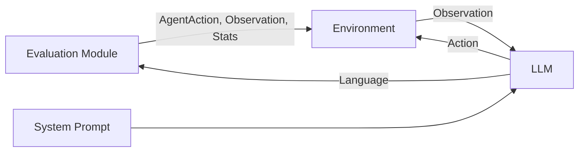

# SR-LLM
Exploring Spatial Reasoning Abilities of LLMs using Reinforcement Learning

CoT Diagram

```mermaid
graph LR
    A[Evaluation Module] -- AgentAction, Observation, Stats --> B[Environment]
    B -- Observation --> C[LLM]
    C -- Action --> B
    D[System Prompt] ---> C
    C -- Language --> A
```

ToT Diagram
...

Reflexion Diagram
...
