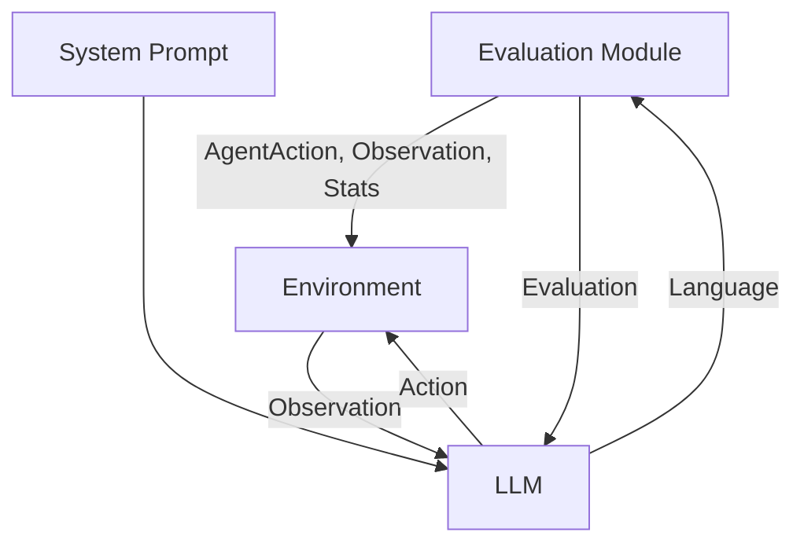

# SR-LLM
Exploring Spatial Reasoning Abilities of LLMs using Reinforcement Learning

```mermaid
graph TB
    A[Evaluation Module] -- AgentAction, Observation, Stats --> B[Environment]
    B -- Observation --> C[LLM]
    C -- Action --> B
    D[System Prompt] ---> C
    A -- Evaluation --> C
    C -- Language --> A
```
