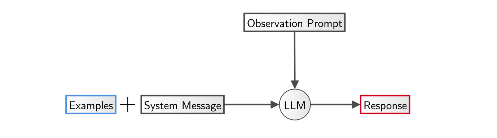
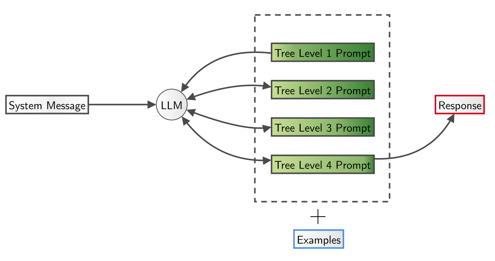
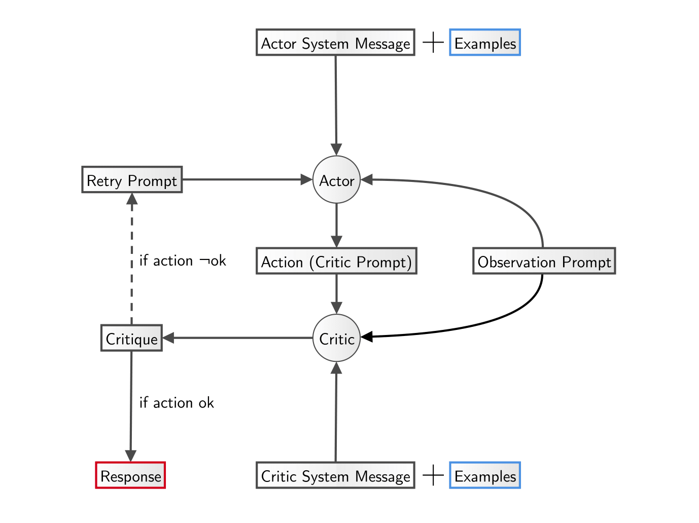
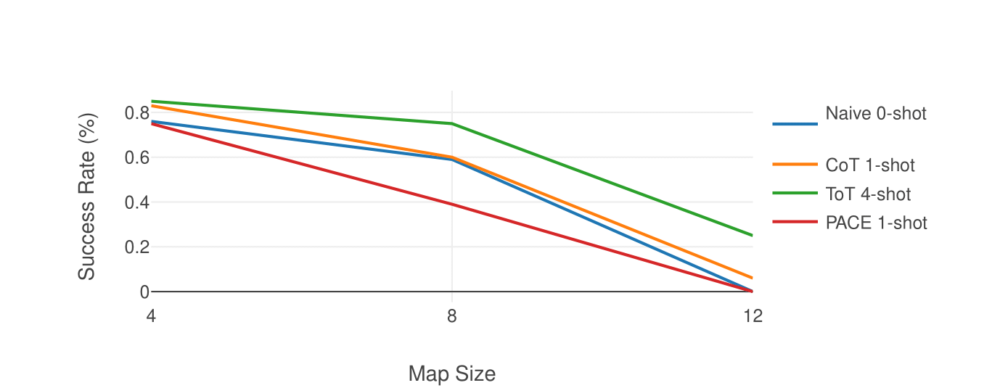

# SR-LLM

### Exploring Spatial Reasoning Abilities of LLMs

With language models becoming powerful assistants in various real-world scenarios, their ability to understand and follow spatial instructions has become crucial. ⁤⁤This thesis investigates the spatial reasoning capabilities of current state-of-the-art language models through a series of controlled experiments and proposes a theoretical foundation for enhancing these capabilities through various prompt engineering techniques and multi-modality. ⁤
Evaluation will be approached systematically by first intelligently prompting the models and assessing the quality of the response as well as its success in the environment. The first experiment is conducted on an LLM (GPT-4o). Subsequently, a different, smaller language model (Mistral-7B-Instruct) is fine-tuned. Finally, performance with the vision modality of GPT-4o is evaluated on a series of spatial tasks, such as path planning and instruction following. Experiments showed that just by deploying prompt engineering, the LLMs behave surprisingly well. This aligns with past research on the reasoning capabilities of language models. However, the thesis can not confirm that a few-shot prompting necessarily constitutes a better performance. Fine-tuning the model did not show ideal results, but a significant improvement over a non-fine-tuned model could be observed. Language models showed promising results when dealing with complex tasks that require spatial understanding and reasoning. \\ 

### CoT Prompting

### ToT Prompting

### PACE Prompting

### Results 

This thesis explored the spatial reasoning capabilities of current state-of-the-art language models (LLMs) through a series of controlled experiments. The primary focus was on evaluating various prompting strategies vs explicit fine-tuning to enhance the performance of LLMs in spatial tasks.

The experiments demonstrated that different prompting strategies significantly impact the performance of LLMs. Contrary to initial expectations, the PACE strategy did not yield the highest success rate. Instead, the Tree-of-Thought (ToT) strategy with 4 shots showed the best overall performance in terms of success and optimal rates. This finding was a pleasant surprise, indicating that more complex, structured prompting can significantly enhance the spatial reasoning abilities of LLMs.

However, the experiments also revealed limitations. The GPT-4o model, when not equipped with memory, often performed repetitive moves or went in circles, negatively affecting both success and optimal rates. This issue underscores the importance of incorporating memory or context into the feedback/observation prompts to improve performance. Both GPT-4o and Mistral-7b-Instruct struggled on bigger maps and planning multiple steps ahead accurately, indicating a broader challenge in current LLMs' ability to manage long-range dependencies in spatial tasks.

Fine-tuning the Mistral-7b-Instruct model showed mixed results. While the model did improve through dine-tuning of the FrozenLake data, the ability to choose the best next action is far from perfect. The high survival rate achieved indicates an understanding of obstacle avoidance but highlights the need for more effective fine-tuning strategies to enhance overall task performance. The fine-tuning process may have justified the fine-tuning more, if the dataset was larger.

The addition of a vision component to the GPT-4o model (GPT-4o-Vision) improved performance in the Spatial Actions Planning (SAP) tasks, aligning with findings in recent research. This enhancement was particularly beneficial in scenarios where textual descriptions alone were insufficient.

In conclusion, while LLMs demonstrated promising results in handling complex tasks requiring spatial understanding and reasoning, there is still significant room for improvement. The challenges observed in planning accuracy and the mixed results from fine-tuning highlight the need for further research and development. Future work should focus on integrating memory and context mechanisms, exploring more sophisticated fine-tuning approaches, and expanding the scope of multi-modal capabilities to advance the spatial reasoning abilities of LLMs.

Overall, this thesis contributes valuable insights into the strengths and limitations of current LLMs in spatial reasoning tasks, providing a foundation for future advancements in this area.

### File Structure and Implementation in Code

1. Minimal set of dependencies
2. Tried not to bloat out the project
3. Used OOP when needed

./src folder contains some of the implementation.

- **src/**: This directory contains the source code. 
  - **frozenlake/**: Everything for convenient creation and manipulation of the FrozenLake environment. Includes metrics, logger and prompt templates.
  - **miniworld/**: Some code for MiniWorld's PutNext environment (WORK IN PROGRESS)
  - **language_models/**: Language models (GPT-4o, GPT-4o Vision, Mistral-7b-Instruct) APIs
  
- **examples/**: Contains shots/examples for various prompting strategies.

- **experiments/**: Contains some evaluation data for the experiments

- **fine_tuning_data/**: Contains JSON fine-tuning samples for Mistral-7b-Instruct 

- **logs/**: Contains some of the conversation logs 

- **maps/**: For now only contains FrozenLake pre-generated maps with solutions in JSON-format 

- **prompt_templates/**: The name is self-explanatory 

- **scripts/**: Contains CLI scripts for generating maps, solving them, visualizing them, running experiments and more! 

- **test/**: Should contain unit-tests (WORK IN PROGRESS) 

## Notebooks

- [FineTuning Notebook (Colab)](https://colab.research.google.com/drive/1KU9aCMk-DjqGXH7EnaV1Q3wxR1G5fYA2)
- [Merging Adapter Notebook (Kaggle)](https://www.kaggle.com/code/arseniikvachan/sr-llm-merge-adapter-with-base-mistral)
- [GGUF Notebook (Kaggle)](https://www.kaggle.com/code/arseniikvachan/sr-llm-quantize-gguf-mistral)

